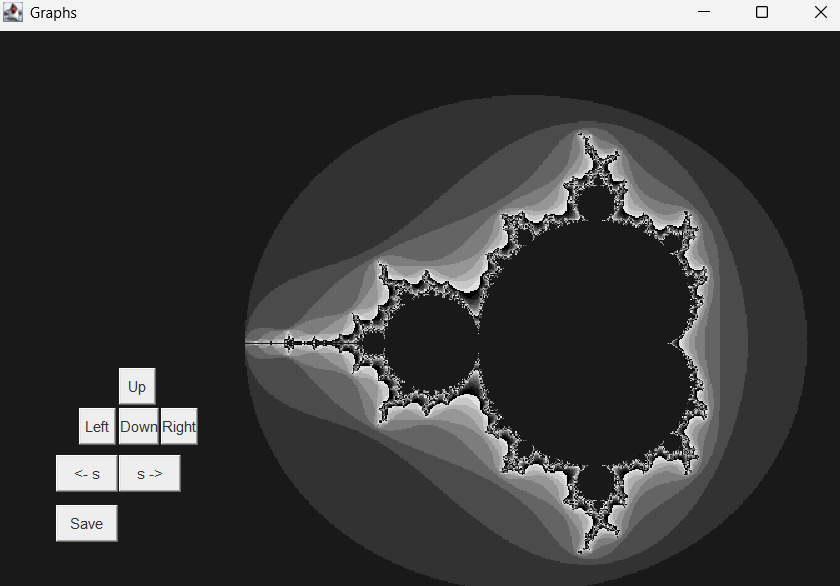

 
This repository contains a couple of java projects that I had implemented from scratch 

  ##  Table of Contents  
1. [Digit Recognition (Mouse, Backprop 7, Convol1)](#1-digit-recognition-mouse-backprop-7-convol1)  
2. [Genetic Algorithm Neural Network (NG2, Essentials)](#2-genetic-algorithm-neural-network-ng2-essentials)  
3. [Mandelbrot Viewer (plot1)](#3-mandelbrot-viewer-plot1)  
4. [Tic Tac Toe AI (tic_toe_1)](#4-tic-tac-toe-ai-tic_toe_1)
5. [Gravitational Simulation (plot4)](#5-gravitational-simulation-plot4)  
6. [High-Precision Pi Calculation (pi6)](#6-high-precision-pi-calculation-pi6)  

---

## **1. Digit Recognition (Mouse, Backprop 7 , Convol1)**  
A complete digit recognition system built entirely in Java, and implemented a fully connected nueral network from scratch, which was trained using the mnist dataset of hand written digits
and also has custom gui. where the user can draw and classify which digit they drew.

**Components:**  
- Convol1 – Resizes and preprocesses image data.  
- Backprop – Trains a fully connected neural network using backpropagation.  
- Mouse – GUI to draw digits and predicts the output.  

**Preview:**  
> _Digit recognizer GUI example (prediction in action)_
  

---

## **2. Genetic Algorithm Neural Network (NG2 + Essentials)**  
A neural network trained on the Ionosphere dataset using a nueral network which was trained by a genetic algorithm which was used to find appropriate weights .

**Results:**  
- **Accuracy:** 93.38%  
- **Precision:** 84%  

---

## **3. Mandelbrot Viewer (plot1)**  
An interactive visualization of the Mandelbrot set. Where the user could zoom in and explore different parts of the mandelbrot set.

Preview:
> _mandelbrot_set 
  

---

## **4. Tic Tac Toe AI (tic_toe_1)**  
A self-play AI for Tic Tac Toe using an evolutionary algorithm which involved nueral networks playing against each other.  

---

## **5. Gravitational Simulation (plot4)**  

A physics-based simulation of gravitational interactions between multiple bodies .  

Preview:
> _Gravitational simulation (orbit visualization)_
  

---

## **6. High-Precision Pi Calculation (pi6)**  
An implementation of the Chudnovsky algorithm (binary splitting) to calculate pi, and was able calculate around 1 million digits of pi in 8 seconds.(on a 13th-gen Intel i5).  

